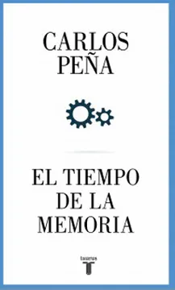

# Síntesis

Resúmenes de libros en lenguaje que intenta ser simple y entendible.

## Libros

### [El tiempo de la memoria](./el-tiempo-de-la-memoria/README.md) - Carlos Peña [2019] 

### [Porqué importa la filosofía](./porque-importa-la-filosofia/README.md) - Carlos Peña [2018]
<a />
